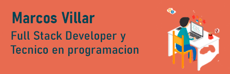

<h2 align="center">
     
    

    Hola  me llamo Marcos Villar   👨🏻‍💻
    

     
    
</h2>
 
<h2 align="left">👨🏻‍💻 Sobre mi:</h2>
💻 Me recibi de <b>Tecnico en Programacion</b>, actualmente estoy terminando el curso de <b>SoyHenry</b> para recibirme de <b>Full Stack</b> y curando la carrera de <b>Ingenieria en informatica</b> en la UNAJ . 
🚀 Escucho propuestas laborales o para proyectos.😊    

<table border="0" align="center">
 <td><b style="font-size:30px">FrontEnd</b></td>
 </table>
<table border="0" align="center">
 <tr>
 </tr>
    <td align="center">
      <h4>Redux</h4>
        
    </td>
    <td align="center">
      <h4>React</h4>
       
    </td>
    <td align="center">
      <h4 >JavaScript</h4>
      
    </td>
    <td align="center">
      <h4>SASS</h4>
      
    </td>
    <td align="center">
      <h4>HTML</h4>
      
    </td>
</table>

 

<table border="0" align="center">
 <td><b style="font-size:30px">BackEnd</b></td>
 </table>
<table border="0" align="center">
 <tr>
 </tr>
    <td align="center">
      <h4>NodeJS</h4>
      
    </td>
    <td align="center">
      <h4>Sequelize</h4>
      
    </td>
    <td align="center">
      <h4>SQL</h4>
       
    </td>
    <td align="center">
      <h4>postgrees</h4>
      
    </td>
    <td >
      <h4>RestAPI</h4>
      
    </td>
</table>

